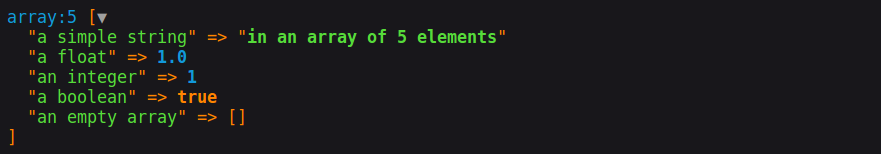

<p align="center">
    <a href="http://www.serendipityhq.com" target="_blank">
        
    </a>
</p>

# VarDumper CLI to HTML

[](https://packagist.org/packages/serendipity_hq/vardumper-cli-to-html)
[](https://github.com/Aerendir/vardumper-cli-to-html/actions)
[](https://github.com/Aerendir/vardumper-cli-to-html/actions)
[](https://github.com/Aerendir/vardumper-cli-to-html/actions)

[](https://packagist.org/packages/serendipity_hq/vardumper-cli-to-html)
[](https://packagist.org/packages/serendipity_hq/vardumper-cli-to-html)
[](https://packagist.org/packages/serendipity_hq/vardumper-cli-to-html)

[](https://sonarcloud.io/dashboard?id=Aerendir_vardumper-cli-to-html)
[](https://sonarcloud.io/dashboard?id=Aerendir_vardumper-cli-to-html)
[](https://sonarcloud.io/dashboard?id=Aerendir_vardumper-cli-to-html)
[](https://sonarcloud.io/dashboard?id=Aerendir_vardumper-cli-to-html)
[](https://sonarcloud.io/dashboard?id=Aerendir_vardumper-cli-to-html)
[](https://sonarcloud.io/dashboard?id=Aerendir_vardumper-cli-to-html)
[](https://sonarcloud.io/dashboard?id=Aerendir_vardumper-cli-to-html)
[](https://insight.sensiolabs.com/projects/daa2a03b-444d-4ea6-8516-10e81c089b84)

[](https://github.com/Aerendir/vardumper-cli-to-html/actions)
[](https://github.com/Aerendir/vardumper-cli-to-html/actions)
[](https://github.com/Aerendir/vardumper-cli-to-html/actions)
[](https://github.com/Aerendir/vardumper-cli-to-html/actions)
[](https://github.com/Aerendir/vardumper-cli-to-html/actions)
[](https://github.com/Aerendir/vardumper-cli-to-html/actions)
[](https://github.com/Aerendir/vardumper-cli-to-html/actions)

Adds functions `dumpf()` and `ddf()` to [Symfony's VarDumper component](https://symfony.com/doc/current/components/var_dumper.html).

## Install VarDumper CLI to HTML via Composer

    $ composer require serendipity_hq/vardumper-cli-to-html --dev

This library follows the http://semver.org/ versioning conventions.

## Usage

The library provides two functions: `dumpf()` and `ddf()`.

They work exactly like the Symfony's VarDumper built ones `dump()` and `dd()`, with those specifities:

1. Both `dumpf()` and `ddf()` can be used only in scripts that run in the command line;
2. Both requires the first parameter is `null` or an array with some options.

The simplest usage is this:

```php
$var = [
    'a simple string' => "in an array of 5 elements",
    'a float' => 1.0,
    'an integer' => 1,
    'a boolean' => true,
    'an empty array' => [],
];
dumpf(null, $var);
ddf(null, $var);
```

The result will be an HTML file with a  random name that contains the dump of `$var`.

Opening the file you will see



For more examples of outputs, consult the Symfony's VarDumper documentation about [Dump Examples and Output](https://symfony.com/doc/current/components/var_dumper.html#dump-examples-and-output).

## Specifying the dumped file

You can specify the file of the dump passing its full path name as first argument:

```console
dumpf('~/path/to/your/folder/filename', $var);
ddf('~/path/to/your/folder/filename', $var);
```

You can use a name like `filename` or like `filename.html`: the resulting file will always have one `.html` extension (`filename.html`).

## Passing options

Both functions accepts as first argument an array.

The passed array can contain any of the options that you can pass to a Symfony's VarDumper Cloner ([reference](https://symfony.com/doc/current/components/var_dumper/advanced.html#cloners)).

The only additional option you can pass is the `file`, whit which you can specify the name of the dumped file:

```php
dumpf(['file' => 'dump_var', 'maxDepth' => 2], $var);
ddf(['file' => 'dump_var.html', 'maxDepth' => 5], $var);
```

In both cases, the file `dump_var.html` will be generated.

## What happens if the file already exists

The new dump will be added to the already existing file.

So, if you call `dumpf()` three times in your CLI script, then the resulting file dump will have three dumps in it.

If you run again the script, the resulting file dump will now contain six dumps in it: the three from the first run and the three from the second run.

To get a fresh dump, simply remove the dumped files.
